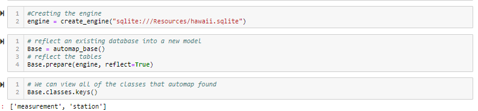
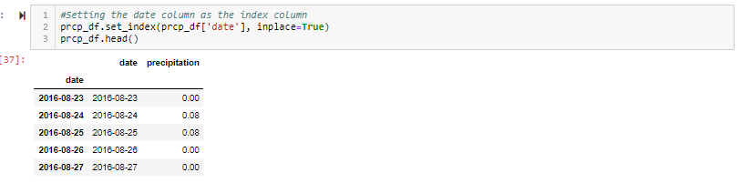
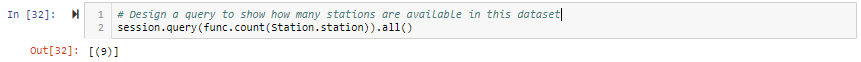
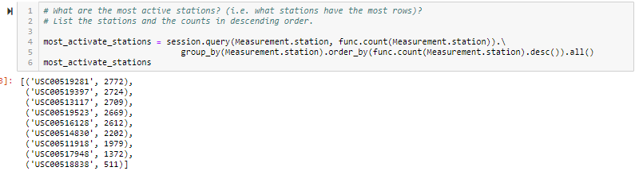
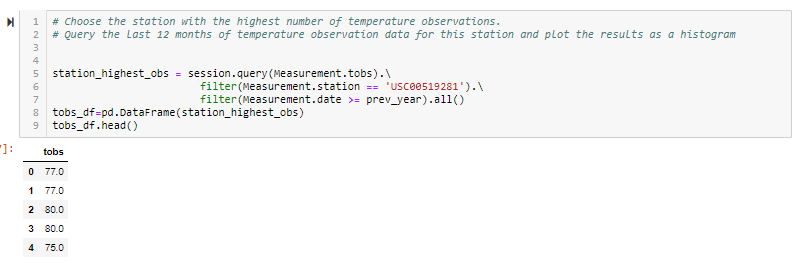

# Surfs Up!

I completed this project during my time at the [Columbia Engineering Data Analytics Bootcamp](https://bootcamp.cvn.columbia.edu/data/nyc/landing/?s=Google-Brand&pkw=%2Bdata%20%2Banalytics%20%2Bcolumbia&pcrid=392444639754&pmt=b&utm_source=google&utm_medium=cpc&utm_campaign=%5BS%5D_GRD_Data_Brand_ALL_NYC_BMM_New&utm_term=%2Bdata%20%2Banalytics%20%2Bcolumbia&utm_content=392444639754&s=google&k=%2Bdata%20%2Banalytics%20%2Bcolumbia&gclid=Cj0KCQiA2b7uBRDsARIsAEE9XpFH-2wU0-_7jtxCV_PCkGBR0prlyKtvpF2-nAWU1tO4oYci5h1QStsaAsg5EALw_wcB&gclsrc=aw.ds) located in New York, NY.

#### -- Project Status: [Completed]

## Project Description

The purpose of this project is to perform a climate analysis and data exploration for the [climate database](https://github.com/CarolineDelva/SurfUp-SQL-Alchemy-Project/tree/master/Resources) and to create a Flask API based on these queries.

The final report includes the following:

#### Climate Analysis and Exploration

* A start date and end date for your trip. Make sure that your vacation range is approximately 3-15 days total.

* An engine to connect to the sqlite database.

* Tables reflected into classes and a reference called `Station` and `Measurement`.

#### Precipitation Analysis

* A query to retrieve the last 12 months of precipitation data for the `date` and `prcp` values.

* A plot of the results

#### Station Analysis

* A query that calculates the total number of stations.

* A query that finds the most active stations and their highest number of observations.
  
* A query that retrieves the last 12 months of temperature observation data (tobs).

* A plot of the results as a histogram with `bins=12`.

#### Climate App

* Home page.

* A JSON representatio of a dictionary using date as the key and prcp as the value

* A JSON list of stations.

* A JSON list of Temperature Observations (tobs) for the previous year.

* A JSON list of the minimum temperature, the average temperature, and the max temperature for a given start or start-end range.

## Methods Used
* Data Visualization
* ORM Query
* Database

## Technologies
* Python (Pandas, Matplotlib, Numpy, Datetime, SQLAlchemy, Flask) 
* SQLite

## Output

#### * Climate Analysis and Exploration

#### * Precipitation Analysis

#### * Station Analysis

## Contact
* [Visit my LinkedIn](https://www.linkedin.com/in/caroline-delva-5184a172/) 
* [Visit my portfolio](https://carolinedelva.github.io/CarolineDelvaPortfolio/) 

